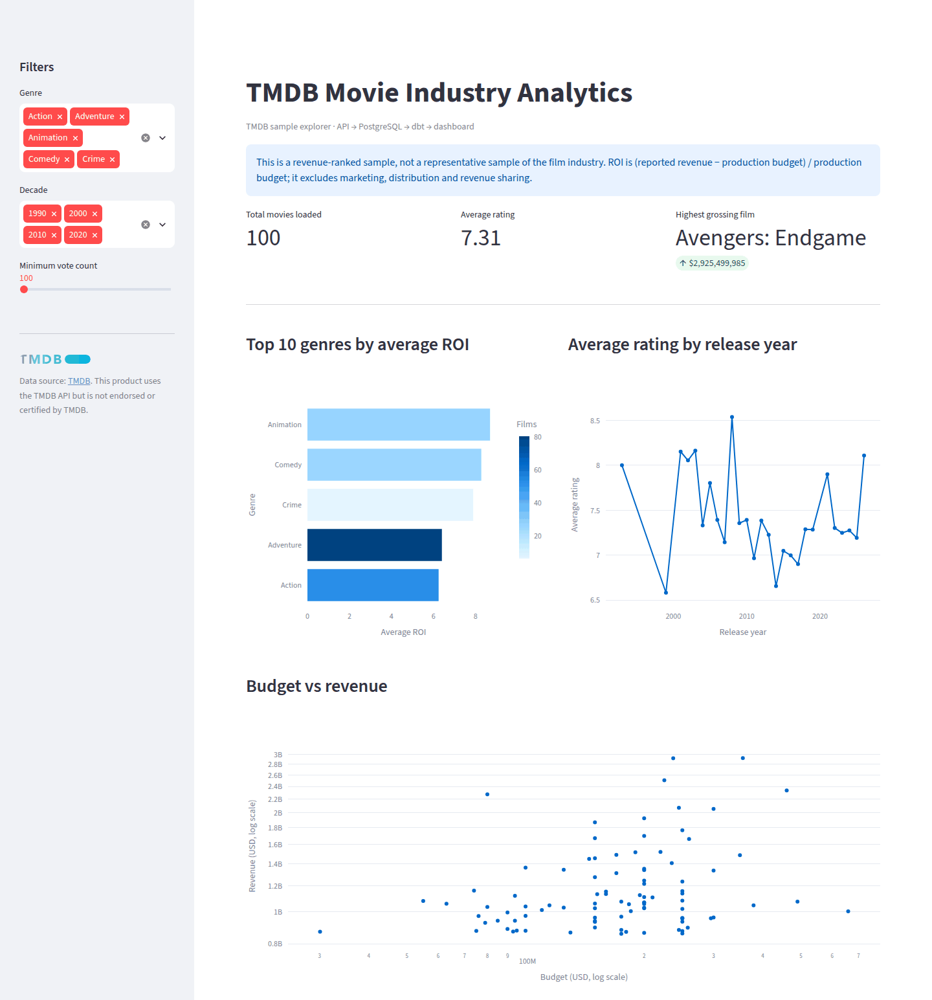
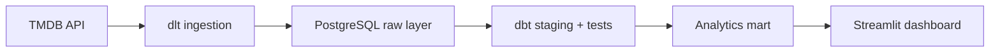

# Movie Industry Analytics Data Product

[](https://github.com/dbechrakis/movie-analytics-data-pipeline/actions/workflows/evidence.yml)

An end-to-end analytics product that turns TMDB API data into tested analytical models and an interactive decision dashboard.

**Stack:** Python · dlt · PostgreSQL · dbt · Streamlit · Plotly · Docker



*Screenshot of the running Streamlit dashboard on the TMDB snapshot ingested 2026-10-05, with the default filters (five genres, all decades, at least 100 votes).*

## Decision in 60 seconds

| Question | Evidence available | Decision supported | Boundary |
|---|---|---|---|
| How do reported movie ratings, budgets and revenues vary by genre and release period in a selected TMDB snapshot? | An API-to-PostgreSQL-to-dbt pipeline, explicit quality tests and a filter-aware Streamlit dashboard. | Run the pipeline with a TMDB key, inspect the resulting dashboard and choose segments worth deeper research. | The [2026-10-05 snapshot](#snapshot-results-2026-10-05) is a single dated run. The default discovery sample is revenue-sorted and filtered, so its genre rankings cannot represent the whole industry. Gross ROI is a proxy, not net investor return. |

This repository supplies the reproducible analysis path, the metric definitions and the results of one recorded run. It does not name a winning genre: the snapshot shows what this sample contains, not what the film industry does. [Run the pipeline locally](#run-locally) to produce a fresh snapshot.

## Snapshot results (2026-10-05)

Results from one full run on 2026-10-05 UTC: TMDB ingestion → PostgreSQL 17 → `dbt run` / `dbt test` → Streamlit. The settings were the defaults: 5 discovery pages, `revenue.desc`, at least 50 votes. TMDB data changes over time, so a rerun will produce different numbers.

| Measure | Value |
|---|---|
| Movies ingested (`raw.movies`) / genres (`raw.genres`) | 100 / 19 |
| Movies after dbt staging filters (`analytics.stg_movies`) | 100 (none removed) |
| Genre × decade rows (`analytics.genre_decade_summary`) | 42 rows · 15 genres · 4 decades |
| Release years covered | 1993–2026 (1990s: 3 · 2000s: 16 · 2010s: 55 · 2020s: 26) |
| Lowest vote count in the sample | 159 |
| Average TMDB rating, all 100 movies | 7.33 |
| Gross ROI proxy, median / mean | 5.79 / 6.89 |
| Highest reported revenue | *Avengers: Endgame* (2019), $2,925,499,985 |
| Reported revenue across the sample | $121.9 billion |
| dbt tests | 11 of 11 passed |

Average gross ROI proxy by genre for genres with at least 10 movies in the sample. Genres overlap, so a movie can be counted under more than one.

| Genre | Movies | Avg ROI proxy | Avg rating |
|---|---:|---:|---:|
| Animation | 26 | 8.69 | 7.32 |
| Comedy | 25 | 8.28 | 7.20 |
| Drama | 10 | 8.10 | 7.79 |
| Family | 31 | 7.54 | 7.19 |
| Fantasy | 35 | 6.52 | 7.41 |
| Adventure | 80 | 6.40 | 7.28 |
| Action | 52 | 6.25 | 7.31 |
| Science Fiction | 36 | 6.18 | 7.19 |
| Thriller | 10 | 6.18 | 7.21 |

Every movie in this sample reported at least $858 million in revenue, so these figures describe blockbusters only. They are not a representative sample of the film industry. Genres with fewer than 10 movies (War, Mystery, Music, History, Crime, Romance) have higher or lower averages that rest on 1–6 films each.

## Business problem

Movie-performance analysis is often built directly on raw API responses, which makes metric definitions, filtering, and repeated analysis inconsistent. This project creates a reproducible path from source data to business-facing analysis so users can investigate:

- which genres show the strongest average gross ROI proxy;
- how ratings vary across release periods;
- how reported production budget relates to reported revenue;
- how conclusions change across genres, decades, and vote-count thresholds.

The product is designed for exploratory decision support, not for claiming causal investment recommendations.

## Solution overview

The system separates ingestion, transformation, testing, and presentation into explicit layers:


```mermaid
flowchart LR
    A["TMDB API"] --> B["dlt ingestion"]
    B --> C["PostgreSQL raw layer"]
    C --> D["dbt staging + tests"]
    D --> E["Analytics mart"]
    E --> F["Streamlit dashboard"]
```

| Layer | Responsibility | Main output |
|---|---|---|
| Ingestion | Extract discovery, movie-detail, and genre data | `raw.movies`, `raw.genres` |
| Staging | Type, clean, filter, and derive movie-level fields | `analytics.stg_movies` |
| Analytics | Aggregate genre × decade performance | `analytics.genre_decade_summary` |
| Quality | Enforce schema and business-rule checks | dbt + Python test results |
| Presentation | Apply consistent filters and surface KPIs/charts | Interactive Streamlit dashboard |

See the [architecture notes](docs/architecture.md) for component boundaries and data contracts.

## Data and metric definitions

The default ingestion requests five TMDB discovery pages sorted by reported revenue and requires at least 50 votes before retrieving movie details. The dbt staging layer then keeps records with:

- a valid title and release date;
- positive reported budget and revenue;
- a rating between 0 and 10.

The key derived metric is:

```text
Gross ROI proxy = (reported revenue - reported production budget) / reported production budget
```

This is **not net investor return**. It excludes marketing, distribution, financing, taxes, and exhibitor revenue sharing. Movies may belong to multiple genres, so genre counts must not be added together as if they were mutually exclusive.

## Data quality and validation

Quality controls exist at three levels:

1. **dbt schema tests** check identifiers, required fields, and movie-grain uniqueness.
2. **dbt singular tests** reject impossible ratings, non-positive financial values, empty marts, and invalid ROI values.
3. **Python regression tests** verify filtered-summary behavior, duplicate handling, empty inputs, and environment parsing.
4. **Source-response checks** reject malformed discovery results and missing or mismatched movie details before records enter the raw layer.

CI lints application code, validates committed evidence, and runs the regression suite on every pull request and push to `main`. CI has no TMDB key or database, so it does not run live ingestion or dbt. [VALIDATION.md](VALIDATION.md) records the local end-to-end run (TMDB → PostgreSQL → dbt → Streamlit) separately from the CI checks. [Design choices and rerun behavior](docs/architecture.md#design-decisions-and-rerun-behavior) spell out the replacement snapshot and partial-failure boundaries.

## Dashboard output

The Streamlit interface provides:

- movie-count, average-rating, and highest-grossing KPIs;
- genre ranking by average gross ROI proxy;
- average-rating trends by release year;
- budget-versus-revenue exploration on logarithmic scales;
- genre, decade, and minimum-vote filters;
- a filtered genre × decade summary table.

All visible summaries use the active dashboard filters. Metrics that require movie grain deduplicate movies after filtering, preventing multi-genre rows from inflating movie-level KPIs.

## Repository structure

```text
movie-analytics-data-pipeline/
├── app/                        # Streamlit deployment entry point
├── dbt/                        # Staging models, mart, tests, and profile
├── docs/                       # Architecture and dashboard screenshot
├── src/movie_analytics/        # Reusable Python package
│   ├── config.py               # Environment configuration
│   ├── ingestion.py            # TMDB → PostgreSQL pipeline
│   ├── metrics.py              # Filter-aware business metrics
│   └── dashboard.py            # Dashboard data access and UI
├── tests/                      # Python regression tests
├── ci/                         # Evidence and syntax validation
├── dashboard.py               # Backward-compatible UI entry point
├── pipeline.py                # Backward-compatible ingestion entry point
├── docker-compose.yml         # Local PostgreSQL service
├── pyproject.toml             # Package metadata
└── requirements.txt           # Runtime dependencies
```

## Run locally

### 1. Create the environment

```bash
python3 -m venv .venv
source .venv/bin/activate
python -m pip install --upgrade pip
python -m pip install -r requirements.txt
cp .env.example .env
```

Add a TMDB API key to `.env`. Never commit `.env` or real credentials.

### 2. Start PostgreSQL

```bash
docker compose up -d
```

### 3. Ingest TMDB data

```bash
python pipeline.py
```

### 4. Build and test the analytics layer

```bash
cd dbt
dbt debug --profiles-dir .
dbt run --profiles-dir .
dbt test --profiles-dir .
cd ..
```

### 5. Launch the dashboard

```bash
streamlit run app/streamlit_app.py
```

The previous command, `streamlit run dashboard.py`, remains supported.

### 6. Run Python tests

```bash
python -m unittest discover -s tests -v
```

## Design decisions and limitations

- **Selected sample:** revenue-ranked TMDB discovery pages are not representative of the film industry.
- **Reported financials:** missing or inaccurate TMDB budget/revenue values can bias results.
- **Descriptive analysis:** associations in the dashboard are not causal effects.
- **Replace loading:** the portfolio-scale ingestion favors reproducibility over incremental history.
- **Local credentials:** defaults support local Docker use only; production secrets require a proper secret manager.

## Future improvements

- Add incremental ingestion with freshness and volume monitoring.
- Introduce orchestration only when scheduled execution is required.
- Add a small deployment dataset or hosted database for a persistent public demo.
- Extend the mart with profitability bands and minimum-sample guardrails for rankings.

## Data attribution


This product uses the TMDB API but is not endorsed or certified by TMDB. Movie metadata, ratings, budgets and revenues come from [The Movie Database (TMDB)](https://www.themoviedb.org/). The dashboard shows the same notice. Use of TMDB data is governed by the [TMDB API Terms of Use](https://www.themoviedb.org/api-terms-of-use).

## Context and ownership

Portfolio case study developed from MSc Data Science coursework at **The American College of Greece** and refactored into a professional analytics-product structure. The academic origin is retained for transparency. See [LICENSING.md](LICENSING.md) for the repository's licensing scope.

**Dimitris Bechrakis**

Business Analyst | Commercial Analytics · Data Products · Applied Data Science
