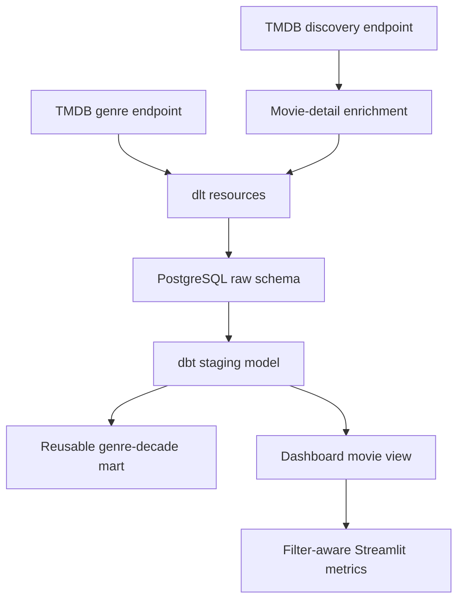

# Architecture and data contracts

## Component flow

## Contracts

| Boundary | Expected contract |
|---|---|
| TMDB → dlt | JSON payloads with movie/genre identifiers; HTTP failures raise immediately |
| dlt → raw | Replace-loaded `movies` and `genres` tables with source and ingestion timestamps |
| Raw → staging | One valid row per movie with typed dates/numerics and a derived gross ROI proxy |
| Staging → mart | One row per genre × decade with unique-film counts and average metrics |
| Database → dashboard | Movie–genre rows that support consistent interactive filtering |

## Failure behavior

- Missing `TMDB_API_KEY` stops ingestion before a pipeline run.
- HTTP errors are surfaced through `raise_for_status()` rather than silently skipped.
- dbt tests fail the build when key data contracts are violated.
- The dashboard shows a setup error and stops when the database or transformed models are unavailable.
- Empty filtered selections produce an explicit dashboard message rather than misleading zero KPIs.

## Trust boundaries

TMDB is an external, user-maintained source. The pipeline validates structure and business rules but cannot guarantee that reported budgets and revenues are complete or economically comparable. Dashboard results should therefore be treated as exploratory signals.
