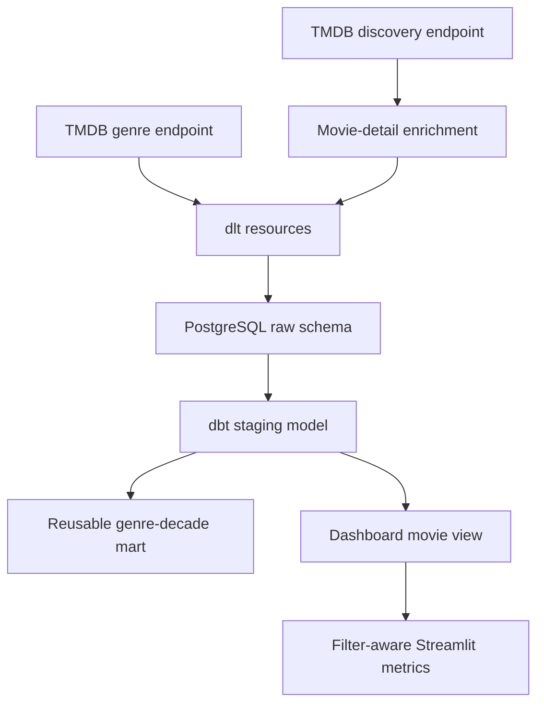

# Architecture and data contracts

## Component flow

```mermaid
flowchart TD
    A["TMDB discovery endpoint"] --> B["Movie-detail enrichment"]
    G["TMDB genre endpoint"] --> C["dlt resources"]
    B --> C
    C --> D["PostgreSQL raw schema"]
    D --> E["dbt staging model"]
    E --> F["Reusable genre-decade mart"]
    E --> H["Dashboard movie view"]
    H --> I["Filter-aware Streamlit metrics"]
```

## Contracts

| Boundary | Expected contract |
|---|---|
| TMDB → dlt | JSON payloads with movie/genre identifiers; HTTP failures raise immediately |
| dlt → raw | Replace-loaded `movies` and `genres` tables with source and ingestion timestamps |
| Raw → staging | One valid row per movie with typed dates/numerics and a derived gross ROI proxy |
| Staging → mart | One row per genre × decade with unique-film counts and average metrics |
| Database → dashboard | Movie–genre rows that support consistent interactive filtering |

## Failure behavior

- Missing `TMDB_API_KEY` stops ingestion before a pipeline run.
- HTTP errors are surfaced through `raise_for_status()` rather than silently skipped.
- dbt tests fail the build when key data contracts are violated.
- The dashboard shows a setup error and stops when the database or transformed models are unavailable.
- Empty filtered selections produce an explicit dashboard message rather than misleading zero KPIs.

## Trust boundaries

TMDB is an external, user-maintained source. The pipeline validates structure and business rules but cannot guarantee that reported budgets and revenues are complete or economically comparable. Dashboard results should therefore be treated as exploratory signals.

## Design decisions and rerun behavior

| Choice | Reason and operational consequence |
|---|---|
| Separate raw, staging and mart layers | Raw records preserve source fields and ingestion time; dbt casts and filters at movie grain; the mart summarizes genre by decade. A rejected record can be inspected before it disappears from analysis. |
| dlt `replace` for both raw resources | Re-running the same discovery scope does not accumulate duplicates across runs. It replaces the selected source snapshot, so a shorter or changed API response can remove previously loaded records. This is snapshot ingestion, not a complete TMDB history. |
| Deduplicate discovery IDs before detail requests | Repeated IDs across pages cost one detail call and yield one raw movie. The first sighting wins within that run. |
| Fail on malformed discovery/detail structures | A 200 response with missing `results`, a wrong movie ID, or absent title/genre list raises before yielding that record. Later discovery pages may legitimately be empty. The source is still external, and these checks do not assert business completeness. |
| dbt for reusable analytical transformations | Staging types and filters and the genre-decade mart live in SQL with dbt tests. Python remains responsible for API ingestion and dashboard metrics; the analytical layer can be rerun and inspected in the database. |

The resources are loaded in one `pipeline.run` call, but this repository does not promise an atomic swap of both raw tables after a mid-run failure. Check the pipeline result and run `dbt build` before trusting a refreshed dashboard. At much larger source volume, full replacement and per-movie detail calls would become expensive; incremental ingestion would require explicit deletion/update and freshness contracts.
